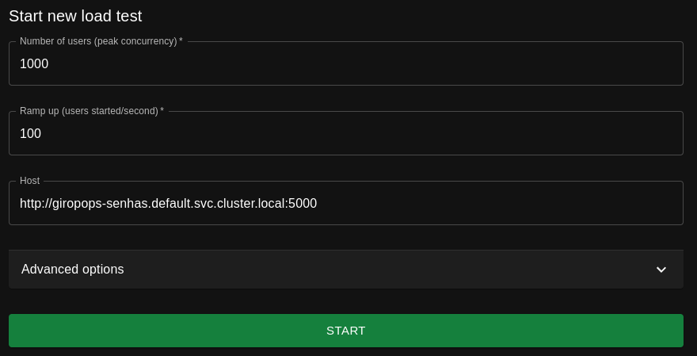

# HPA - LinuxTips

<br>

Criar, usando o Kubernetes, Pods com alta disponibilidade usando a imagem `ferpdias/linuxtips-giropops-senhas:1.0`.
Para a alta disponibilidade será usado o HPA (Horizontal Pod Autoscaler) e o para estressar os Pods será usado o Locust.  
O cluster Kubernetes será criado no MS Azure usando o repositório [Terraform-Azure-VMs-Kubernetes](https://github.com/ferpaesdias/Terraform-Azure-VMs-Kubernetes).

<br>

## Clonar repositório

Clone este repositório e acesse o diretório que foi criado

```shell
git clone https://github.com/ferpaesdias/HPA-LinuxTips.git

cd HPA-LinuxTips
```

<br>

## Giropops-Senhas

Primeiro vamos iniciar o Deployment e o Service (`ClusterIP`) do Redis:

```shell
kubectl apply -f redis-deployment-svc.yaml
```

<br>


Para iniciar o Deployment e o Service (`NodePort`) do app Giropops-Senhas execute o comando abaixo:

```shell
kubectl apply -f giropops-deployment-svc.yaml
```

<br>

Verifique se os Pods estão sendo executados:

```shell
kubectl get pods
```

<br>

A saída do comando deve ser semelhante a abaixo, como um Pod do Giropops-Senhas e um Pod do Redis em execução:

```shell
kubectl get pods
NAME                               READY   STATUS    RESTARTS   AGE
giropops-senhas-5db4765fc5-vrsk8   1/1     Running   0          9s
redis-974d9f5ff-s45w7              1/1     Running   0          31s
```

<br>

Verifique se os Services estão sendo executados:

```shell
kubectl get svc
```

<br>

A saída do comando deve ser semelhante a abaixo, como o Service `redis` do tipo `ClusterIP` e o Service `giropops-senhas` do tipo `NodePort` em execução:

```shell
kubectl get svc
NAME              TYPE        CLUSTER-IP     EXTERNAL-IP   PORT(S)          AGE
giropops-senhas   NodePort    10.97.26.238   <none>        5000:30100/TCP   6m55s
kubernetes        ClusterIP   10.96.0.1      <none>        443/TCP          121m
redis             ClusterIP   10.96.20.34    <none>        6379/TCP         12m
```

Como em meu Cluster eu não tenho um objeto Ingress configurado, eu optei por expor a porta do Giropops-Senhas usando um Service do tipo `NodePort`. A porta exposta e a `30100`.
 
<br>

Use este endereço para acessar o app Giropops-Senhas

```shell
http://<IP_do_seu_cluster>:30100
```

<br>

##  Metrics Server

Para utilizar o HPA funcionar é necessário ter o Metrics Server. Execute o comando abaixo para configurá-lo:

```shell
kubectl apply -f metrics-server.yaml
```

<br>

O comando abaixo mostra o uso de CPU e de memória dos Nodes:

```shell
kubectl top nodes
```

<br>

O comando abaixo mostra o uso de CPU e de memória dos Pods:

```shell
kubectl top pods
```

<br>


## HPA (Horizontal Pods Autoscaler)

Execute o comando abaixo para configurar o HPA:

```shell
kubectl apply -f hpa.yaml
```

<br>

O HAP está configurado para ter no mínimo 03 réplicas, portanto, agora você deve ter 03 Pods do Giropops-Senhas:

```shell
kubectl get pods
NAME                               READY   STATUS        RESTARTS   AGE
giropops-senhas-5b74c99d66-nbpdj   1/1     Running       0          15s
giropops-senhas-5b74c99d66-qmxbf   1/1     Running       0          23s
giropops-senhas-5b74c99d66-qmxfz   1/1     Running       0          15s
redis-974d9f5ff-s45w7              1/1     Running       0          46m
```

<br>

## Iniciando o Locust

Execute o comando abaixo para iniciar o Deployment, o Service e o ConfigMap:

```shell
kubectl apply -f locust.yaml
```
 
O Dockerfile e demais arquivos do Locust estão no diretório Locust.

<br>


Use este endereço para acessar o Locust:

```shell
http://<IP_do_seu_cluster>:30101
```

<br>

Preencha os campos conforme a imagem abaixo e clique em start:



<br>

Liste os Pods e veja a quantidade de Pods do Giropops-Senhas aumentar:

```shell
kubectl get pods
NAME                               READY   STATUS        RESTARTS   AGE
giropops-senhas-5b74c99d66-2wtn4   1/1     Running   0             7m50s
giropops-senhas-5b74c99d66-4h78f   1/1     Running   0             8m20s
giropops-senhas-5b74c99d66-8cfrc   1/1     Running   0             29m
giropops-senhas-5b74c99d66-8q84x   1/1     Running   0             8m20s
giropops-senhas-5b74c99d66-grk9q   1/1     Running   0             29m
giropops-senhas-5b74c99d66-mgmxr   1/1     Running   0             28m
giropops-senhas-5b74c99d66-nmdl4   1/1     Running   0             29m
giropops-senhas-5b74c99d66-pm2b9   1/1     Running   0             8m20s
giropops-senhas-5b74c99d66-pvv85   1/1     Running   0             8m20s
giropops-senhas-5b74c99d66-wk9k5   1/1     Running   0             7m50s
locust-giropops-c5797f8f5-sqg2k    1/1     Running   1 (14m ago)   14m
redis-974d9f5ff-s45w7              1/1     Running       0          46m
```
